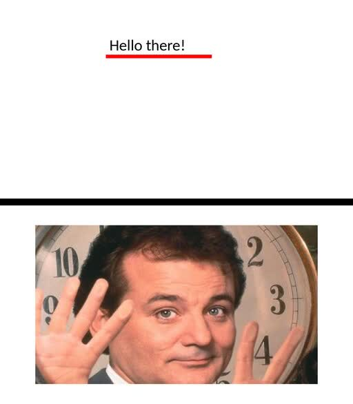

# react-pptx

[](https://www.npmjs.com/package/react-pptx)

React wrapper for [PptxGenJS](https://gitbrent.github.io/PptxGenJS/). Try at https://wyozi.github.io/react-pptx/



```jsx
import {
  Presentation, Slide, Text,
  Shape, Image, render
} from "react-pptx";
import fs from "fs";

render(
  <Presentation>
    <Slide>
      <Text style={{
        x: 3, y: 1, w: 3, h: 0.5,
        fontSize: 32
      }}>
        Hello there!
      </Text>
      <Shape
        type="rect"
        style={{
          x: 3, y: 1.55, w: 3, h: 0.1,
          backgroundColor: "#FF0000"
        }}
      />
    </Slide>
    <Slide>
      <Image
        src={{
          kind: "path",
          path: "http://www.fillmurray.com/460/300"
        }}
        style={{
          x: "10%", y: "10%", w: "80%", h: "80%"
        }}
      />
    </Slide>
  </Presentation>
).then(buffer => {
  fs.writeFile("presentation.pptx", buffer);
});
```

## Api

### `ReactPPTX.render(<presentation>): Promise<Buffer>`

Asynchronously renders given presentation JSX.

### `<Presentation>`

Wraps the whole presentation.

#### Props

| name | type | default value | description |
| -- | -- | -- | -- |
| `layout` | "16x9", "16x10", "4x3", or "wide" | "16x9" | [Slide size](https://gitbrent.github.io/PptxGenJS/docs/usage-pres-options.html#slide-layouts-sizes) |

### `<Slide>`

Represents each slide in the presentation.

#### Props

| name | type | default value | description |
| -- | -- | -- | -- |
| `hidden` | boolean | false | Whether this slide is hidden during presenting |
| `style.backgroundColor` | color |  | Slide background color |
| `style.backgroundImage` | `{kind: "path", path: ""} \| {kind: "data", data: ""}` |  | Background image url |

### `<Text>`

Text layer

#### Props

| name | type | default value | description |
| -- | -- | -- | -- |
| `style.x` | number (inches) or string (percentage) |  | Absolute `x` coordinate |
| `style.y` | number (inches) or string (percentage) |  | Absolute `y` coordinate |
| `style.w` | number (inches) or string (percentage) |  | Absolute width |
| `style.h` | number (inches) or string (percentage) |  | Absolute height |
| `style.color` | color | | Text color |
| `style.fontFace` | string | Arial | Font family. Try to stick to [web-safe fonts](https://www.cssfontstack.com/) |
| `style.fontSize` | size in **points** | 18 | Font size. Defined in points (96 dpi by default) |
| `style.align` | "left" or "center" or "right" | left | Horizontal text alignment within the text box |
| `style.verticalAlign` | "top" or "middle" or "bottom" | middle | Vertical text alignment within the text box |

### `<Text.Link>`

Link to somewhere. Only usable inside `<Text>`. You must specify either `url` or `slide`.

#### Props

| name | type | default value | description |
| -- | -- | -- | -- |
| `url` | string |  | URL to open |
| `slide` | number |  | Slide to open |
| `tooltip` | string |  | Tooltip on hover |

### `<Image>`

Image layer. Images are automatically fetched and embedded into the .pptx files during the rendering phase.

Supports png, jpg, svg, gif and animated gif.

#### Props

| name | type | default value | description |
| -- | -- | -- | -- |
| `src` | `{kind: "path", path: ""} \| {kind: "data", data: ""}` |  | Image URL |
| `style.x` | number (inches) or string (percentage) | | Absolute `x` coordinate |
| `style.y` | number (inches) or string (percentage) | | Absolute `y` coordinate |
| `style.w` | number (inches) or string (percentage) | | Absolute width |
| `style.h` | number (inches) or string (percentage) | | Absolute height |

### `<Shape>`

Shape layer.

#### Props

| name | type | default value | description |
| -- | -- | -- | -- |
| `type` | shape types |  | Shape type |
| `style.x` | number (inches) or string (percentage) | | Absolute `x` coordinate |
| `style.y` | number (inches) or string (percentage) | | Absolute `y` coordinate |
| `style.w` | number (inches) or string (percentage) | | Absolute width |
| `style.h` | number (inches) or string (percentage) | | Absolute height |
| `style.backgroundColor` | complex color |  | Shape background color |


<details>
  <summary><b>Shape types</b></summary>

  To find out how these look, easiest to just Google.

- accentBorderCallout1
- accentBorderCallout2
- accentBorderCallout3
- accentCallout1
- accentCallout2
- accentCallout3
- actionButtonBackPrevious
- actionButtonBeginning
- actionButtonBlank
- actionButtonDocument
- actionButtonEnd
- actionButtonForwardNext
- actionButtonHelp
- actionButtonHome
- actionButtonInformation
- actionButtonMovie
- actionButtonReturn
- actionButtonSound
- arc
- bentArrow
- bentUpArrow
- bevel
- blockArc
- borderCallout1
- borderCallout2
- borderCallout3
- bracePair
- bracketPair
- callout1
- callout2
- callout3
- can
- chartPlus
- chartStar
- chartX
- chevron
- chord
- circularArrow
- cloud
- cloudCallout
- corner
- cornerTabs
- cube
- curvedDownArrow
- curvedLeftArrow
- curvedRightArrow
- curvedUpArrow
- decagon
- diagStripe
- diamond
- dodecagon
- donut
- doubleWave
- downArrow
- downArrowCallout
- ellipse
- ellipseRibbon
- ellipseRibbon2
- flowChartAlternateProcess
- flowChartCollate
- flowChartConnector
- flowChartDecision
- flowChartDelay
- flowChartDisplay
- flowChartDocument
- flowChartExtract
- flowChartInputOutput
- flowChartInternalStorage
- flowChartMagneticDisk
- flowChartMagneticDrum
- flowChartMagneticTape
- flowChartManualInput
- flowChartManualOperation
- flowChartMerge
- flowChartMultidocument
- flowChartOfflineStorage
- flowChartOffpageConnector
- flowChartOnlineStorage
- flowChartOr
- flowChartPredefinedProces'flowChartPredefinedProcess',
- flowChartPreparation
- flowChartProcess
- flowChartPunchedCard
- flowChartPunchedTape
- flowChartSort
- flowChartSummingJunction
- flowChartTerminator
- folderCorner
- frame
- funnel
- gear6
- gear9
- halfFrame
- heart
- heptagon
- hexagon
- homePlate
- horizontalScroll
- irregularSeal1
- irregularSeal2
- leftArrow
- leftArrowCallout
- leftBrace
- leftBracket
- leftCircularArrow
- leftRightArrow
- leftRightArrowCallout
- leftRightCircularArrow
- leftRightRibbon
- leftRightUpArrow
- leftUpArrow
- lightningBolt
- line
- lineInv
- mathDivide
- mathEqual
- mathMinus
- mathMultiply
- mathNotEqual
- mathPlus
- moon
- nonIsoscelesTrapezoid
- noSmoking
- notchedRightArrow
- octagon
- parallelogram
- pentagon
- pie
- pieWedge
- plaque
- plaqueTabs
- plus
- quadArrow
- quadArrowCallout
- rect
- ribbon
- ribbon2
- rightArrow
- rightArrowCallout
- rightBrace
- rightBracket
- round1Rect
- round2DiagRect
- round2SameRect
- roundRect
- rtTriangle
- smileyFace
- snip1Rect
- snip2DiagRect
- snip2SameRect
- snipRoundRect
- squareTabs
- star10
- star12
- star16
- star24
- star32
- star4
- star5
- star6
- star7
- star8
- stripedRightArrow
- sun
- swooshArrow
- teardrop
- trapezoid
- triangle
- upArrow
- upArrowCallout
- upDownArrow
- upDownArrowCallout
- uturnArrow
- verticalScroll
- wave
- wedgeEllipseCallout
- wedgeRectCallout
- wedgeRoundRectCallout
</details>

<details>
  <summary><b>Complex colors</b></summary>

  Shapes support complex colors for the backgroundColor property.
  These are the currently supported complex color types:
  - Translucent colors (e.g. `rgba(255, 127, 0, 0.5)` for orange at 50% opacity)
</details>

## Credits / Shoutouts

- All the hard work is done in [pptxgenjs](https://github.com/gitbrent/PptxGenJS) by Brent Ely 
- [react-pdf](https://react-pdf.org/) for REPL code
- [react-keyed-flatten-children](https://github.com/grrowl/react-keyed-flatten-children)
